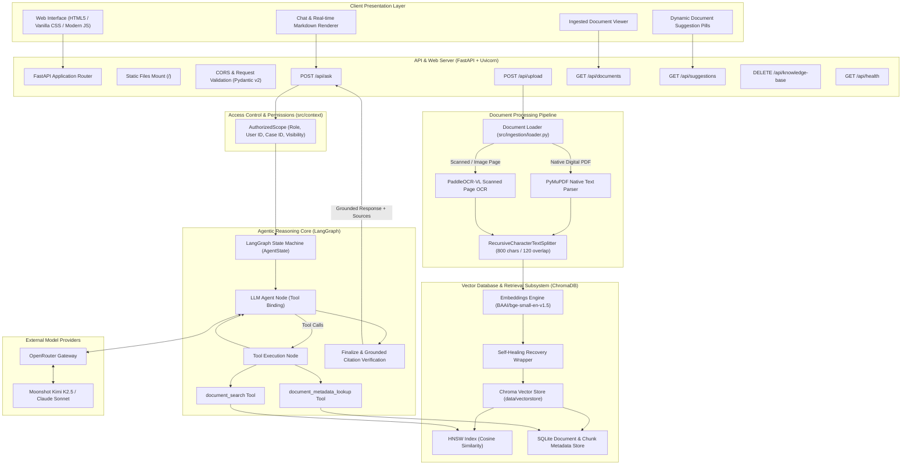
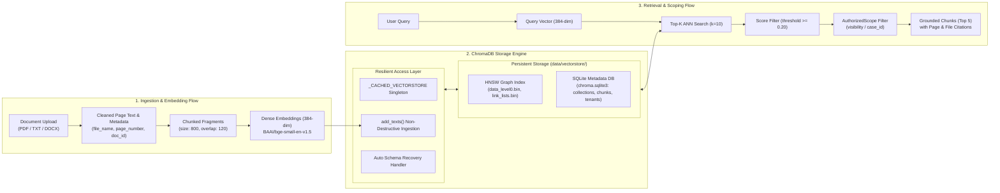

# Cruvels AI Legal Knowledge Assistant — System Architecture

Comprehensive architectural specification for the **Cruvels AI Legal Knowledge Assistant**, including end-to-end data flow, multi-agent orchestration, OCR ingestion pipeline, and dedicated vector database subsystem.

---

## 1. End-to-End System Architecture



---

## 2. Dedicated Vector Database & Retrieval Architecture



---

## 3. Data Flow & Lifecycle Specification

### A. Document Ingestion Lifecycle
1. **Upload**: Client sends `multipart/form-data` to `/api/upload`.
2. **Parsing**: PyMuPDF extracts native text per page. If text density is below threshold, PaddleOCR-VL runs per-page OCR.
3. **Chunking**: `RecursiveCharacterTextSplitter` divides text into overlapping segments (800 chars / 120 overlap).
4. **Vector Generation**: `BAAI/bge-small-en-v1.5` creates 384-dimensional dense vectors in batched operations.
5. **Storage**: Vectors and metadata (`doc_id`, `file_name`, `page_number`, `visibility`) are indexed into ChromaDB.

### B. Agentic Q&A Query Lifecycle
1. **Query Ingestion**: Client submits prompt to `/api/ask`.
2. **Context Creation**: `AuthorizedScope` is attached to bind security boundaries.
3. **Agent Loop (LangGraph)**:
   - System prompt configures the agent to act as a rigorous legal assistant.
   - LLM decides whether to call `document_search(query)` or `document_metadata_lookup(doc_id)`.
   - Tool calls execute bounded searches (max budget: 4 iterations).
4. **Grounded Citation Verification**:
   - `finalize` node checks if evidence was retrieved via tools.
   - If no relevant evidence was found, triggers the deterministic fallback message:
     `"I don't have enough information in the available documents to answer this reliably."`
   - If evidence exists, attaches exact source file names and page numbers.

---

## 4. Vector Store Schema & Data Structures

```json
{
  "id": "sample_nda_p1_c0",
  "document": "1. Confidentiality Obligations. The Recipient shall maintain...",
  "embedding": [0.0381, -0.0129, 0.0894, "... 384 dimensions ..."],
  "metadata": {
    "chunk_id": "sample_nda_p1_c0",
    "doc_id": "sample_nda",
    "file_name": "sample_nda.pdf",
    "page_number": 1,
    "source_type": "native",
    "visibility": "shared"
  }
}
```

---

## 5. Key Design Principles

- **Zero-Hallucination Fallback**: Guarantees legal safety by returning a strict fallback message when no direct document evidence is retrieved.
- **In-Memory Model Caching**: Embedding model and Chroma client are loaded as cached singletons to eliminate per-request latency.
- **Self-Healing Vector Database**: Built-in migration and corruption recovery handles database restarts and schema transitions automatically.
- **Multi-Tenant Scoping**: Role-based access control filters chunks at retrieval time before reaching LLM context.
